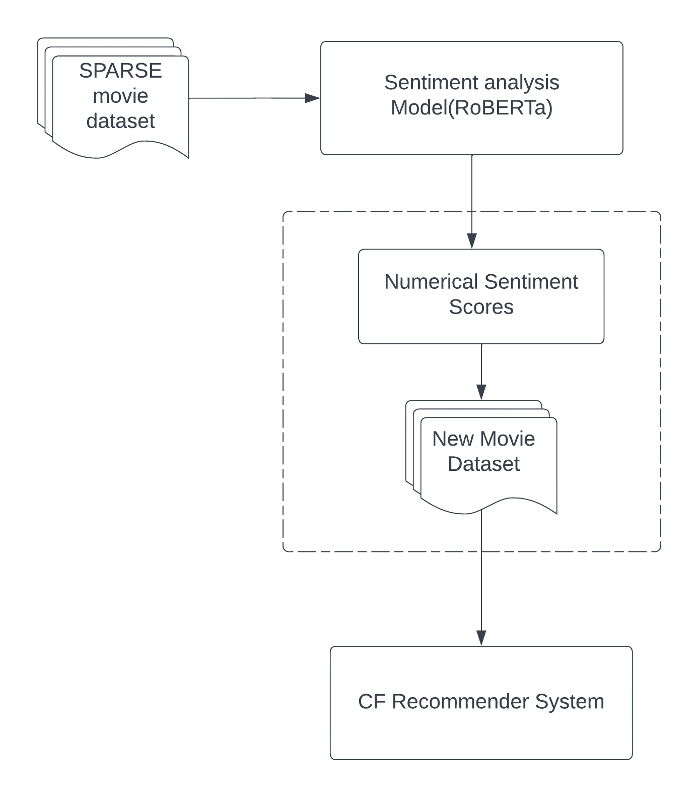

# An enhanced Recommender System by Sentiment-Analysis

##Motivation

Recommender systems have become a very crucial application in the online market and e-commerce especially Collaborative Filtering (CF) recommenders which usually gives satisfying results.  However, their effectiveness deteriorates if there exist insufficient ratings, which is known as data sparsity, and data sparsity would further lead to a cold start issue. Existing methods address the data sparsity issue by applying token-level sentiment analysis that converts (illustrates) text review into sentiment scores (ratings) as a complement of the user rating. In this repository, we attempt to optimize the sentiment analysis with advanced NLP models including the use of deep learning models like RoBERTa, and use it to enhance the CF recommender.

##Methodology

I started to obtain a sparse dataset to simulate the data sparsity issue, we randomly dropped 40% of the user rating of (the Amazon US Reviews
dataset with the category "Video"), so the dataset contains only 60% of the true user rating. Further operations (e.g. create user-item matrix, obtain sentiment ratings) and experimentation are achieved with this preprocessed sparse dataset.
Then we worked on sentiment Analysis step:

Since sentiment analysis is basically a sequence classification task, where the numerical ratings from 1-5 can be considered as 5 labels, we add an multilayer perceptron(MLP) as the classification head of the PLMs that maps the last hidden layer to the label space with the softmax activation function. We then fine tune the PLMs (RoBERTa) on the 60% of the dataset where the rating exists, with the embedded textual reviews as the input and corresponding numerical ratings as the target label. Once we obtain the fine-tuned PLMs, we complemented the 40% whose rating has been dropped with the sentiment scores predicted by the fine-tuned PLMs. Eventually, we can build CF recommenders that are enhanced by sentiment analysis with the fine-tuned PLMs with 60% of the true user rating and 40% of the sentiment rating.

Then we have trained an Alternating Least Squares (ALS) for our Collaborative Filtering Recommendation system with explicit feedback (rating).

##DATASET
[amazon_us_reviews](https://huggingface.co/datasets/amazon_us_reviews)
Amazon Customer Reviews is one of Amazon's iconic products. In a period of over two decades since the first review in 1995, millions of Amazon customers have contributed over a hundred million reviews to express opinions and describe their experiences regarding products on the Amazon.com website. This makes Amazon Customer Reviews a rich source of information for academic researchers in the fields of Natural Language Processing (NLP), Information Retrieval (IR), and Machine Learning (ML), amongst others. Accordingly, we are releasing this data to further research in multiple disciplines related to understanding customer product experiences. Specifically, “amazon_us_reviews” was constructed to represent a sample of customer evaluations and opinions, variation in the perception of a product across geographical regions, and promotional intent or bias in reviews. Over 130+ million customer reviews are available to researchers as part of this release. Each line in the data files corresponds to an individual review (tab-delimited, with no quote and escape characters). Each Dataset contains the following columns: 

* marketplace - 2-letter country code of the marketplace where the review was written.
* customer_id - A random identifier that can be used to aggregate reviews written by a single author.
* review_id - The unique ID of the review.
* product_id - The unique Product ID the review pertains to. In the multilingual dataset, the reviews for the same product in different countries can be grouped by the same product_id. 
* product_parent - A Random identifier that can be used to aggregate reviews for the same product.
* product_title - Title of the product. 
* product_category - Broad product category that can be used to group reviews (also used to group the dataset into coherent parts). 
* star_rating -  [1-5] star rating of the review.
* helpful_votes - Number of helpful votes.
* total_votes - Number of total votes the review received.
* vine - Review was written as part of the Vine program. 
* verified_purchase - The review is on a verified purchase.
* review_headline - The title of the review. 
* review_body - The review text.
* review_date - The date the review was written.

**We will use part of this dataset just for the product “Video_v1_00” of the US place.**

## Fine-tune RoBERTa:
I used the base version for RoBERTa, that is pretrained on the Wikipedia and Book corpus dataset, and contain 125M parameters respectively, due to the performance-runtime trade-off.
Then I finetuned the model and tried to optimize the hyperparameters to get highest accuracy using **Hugging Face Transformers**.

## The Recommender system:

I used Spark.MLlib to train an Alternating Least Squares (ALS) for the Collaborative Filtering Recommendation system  with explicit feedback (rating). 

